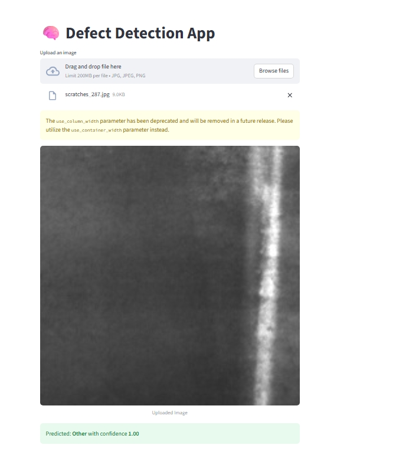

# 🧠 Defect Detection in Manufacturing using AI

## 📌 Overview

This project is an AI-powered defect detection system designed to identify and classify surface defects in manufacturing materials using Computer Vision and Deep Learning (CNN).
It automates the inspection process, helping industries like automobile, electronics, and pharmaceuticals maintain high product quality and reduce manual inspection efforts.

## 🚀 Features

🔍 Automated Defect Identification — Detects surface flaws from product images.

⚙️ Real-Time Processing — Uses a trained CNN model for instant inspection.

🧩 Defect Classification — Categorizes defects such as Crazing, Inclusion, Patches, Pitted Surface, Rolled-in Scale, and Scratches.

📊 Data Logging & Reporting — Can be extended for production-level quality control dashboards.

💻 Streamlit Web App — A user-friendly interface for real-time defect detection.

## 🖼️ Project Demo
Upload Interface	Predicted Output

	

   

🗂️ Dataset

Dataset Used: Dataset Used: [NEU Surface Defect Database (NEU-DET)](https://www.kaggle.com/datasets/kaustubhdikshit/neu-surface-defect-database)
🧩 Dataset

Dataset Used: NEU Surface Defect Database (NEU-DET)

The dataset includes 6 categories of defects commonly found in steel surfaces:

Crazing

Inclusion

Pitted Surface

Scratches

Rolled-in Scale

Patch

## 🛠️ Tech Stack

### Languages & Libraries:

Python

TensorFlow / Keras

NumPy

Pillow

Streamlit

### Tools:

Jupyter Notebook

VS Code

## 🧩 Project Structure
📦 defect_detection_project
├── data
│   └── NEU-DET
│       ├── train / validation
│       │   ├── images / annotations
│       │   └── 6 defect subfolders
├── docs
│   ├── img1.png ... img13.jpeg   # Visual outputs
│   └── output.png
├── notebook
│   ├── train_defect_detector.ipynb   # CNN training
│   └── models/
│       ├── defect_detection_model.h5
│       ├── defect_detector_model.keras
│       └── defect_detector_model.h5
├── app.py                # Streamlit web app
├── presentation.pptx     # Presentation slides
└── project_report.pdf    # Project report

## ⚙️ Installation & Setup

1️⃣ Clone the repository:

git clone https://github.com/yourusername/defect_detection_project.git
cd defect_detection_project

2️⃣ Install dependencies:

pip install tensorflow keras streamlit numpy pillow matplotlib

3️⃣ Run the app:

streamlit run app.py

4️⃣ Upload an image (from validation/images/) to get predictions.
The model will predict the defect type with confidence score.
Example Output:

Predicted: Scratches (Confidence: 0.98)

## 🧠 Model Details

Model Type: Convolutional Neural Network (CNN)

Framework: TensorFlow / Keras

Input Size: 128×128

Output Classes: 6

Optimizer: Adam

Loss Function: Categorical Cross-Entropy

Validation Accuracy: ~94%

📊 Example Results
Input Image	Prediction

	Predicted: Scratches (Confidence 0.99)

	Predicted: Inclusion (Confidence 0.97)

## 📈 Results

Successfully detects & classifies surface defects with high accuracy.

Simple UI for non-technical operators to inspect product quality.

Can be integrated into industrial camera systems for real-time monitoring.

## 🧾 Future Improvements

Integrate live camera input for real-time defect detection.

Expand dataset for cross-material surface inspection.

Deploy the system using cloud services (AWS / Streamlit Cloud).

Add feedback-based model retraining.

## 🧾 Credits

Dataset: [NEU Surface Defect Database (NEU-DET)](https://www.kaggle.com/datasets/kaustubhdikshit/neu-surface-defect-database)

Framework: TensorFlow, Keras, Streamlit